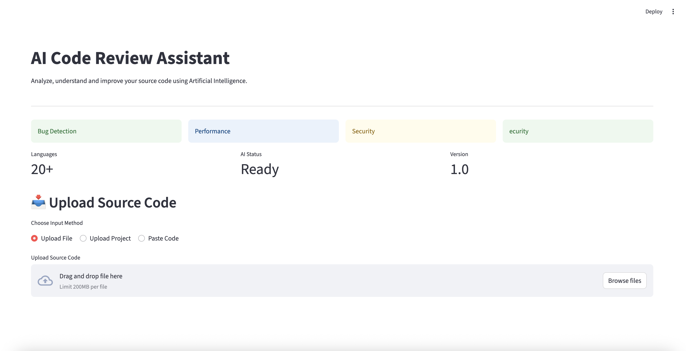
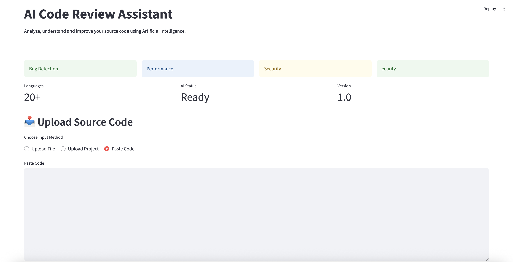
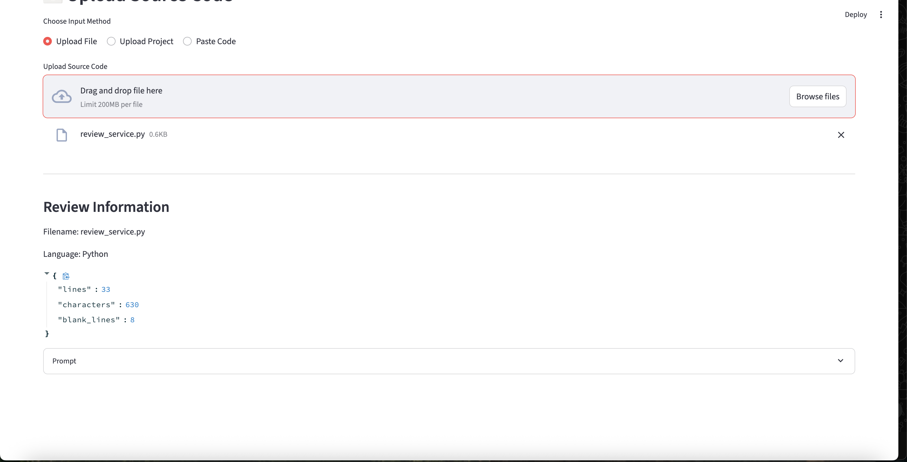
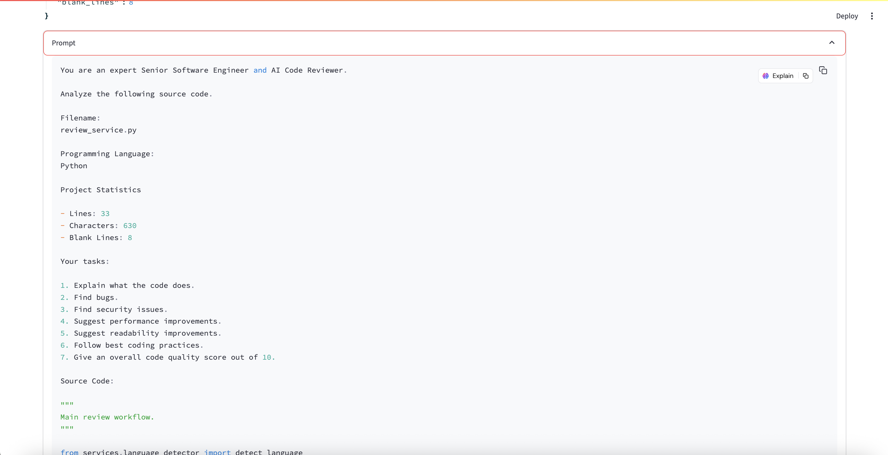

<!-- # AI Code Review Assistant

An AI-powered application for reviewing source code using Large Language Models.

## Features

- Upload source code files
- Upload projects
- Paste code
- AI-powered review
- Bug detection
- Security analysis
- Performance suggestions
- Export reports

## Tech Stack

- Python
- Streamlit
- OpenAI API
- Pydantic -->

# AI Code Review Assistant

> An AI-powered code review application that analyzes source code, detects bugs, identifies security issues, suggests performance improvements, and explains code using Large Language Models (LLMs).


---

# Overview

AI Code Review Assistant is a modern web application built with **Python** and **Streamlit** that helps developers review code intelligently.

The application supports multiple input methods, performs local static analysis, detects the programming language automatically, and generates detailed AI-powered reviews using LLMs such as OpenAI, Gemini, or OpenRouter.

The project follows a modular architecture, making it scalable, maintainable, and easy to extend.

---

# Clips of Project





#  Features

###  Input Options

- Upload a single source code file
- Upload an entire project folder
- Paste code directly into the editor

---

###  Code Analysis

- Automatic language detection
- Static code analysis
- Code metrics
- Line counting
- Character counting
- Blank line detection

---

### AI Review

Generate detailed reviews including:

- Bug Detection
- Security Analysis
- Performance Suggestions
- Code Explanation
- Readability Improvements
- Best Practices
- Code Quality Score

---

### Reports

Generate professional reports containing:

- AI Review
- Statistics
- Recommendations
- Exportable Reports (Coming Soon)

---

# System Architecture

```text
                        User
                          │
                          ▼
                  Streamlit Frontend
                          │
          ┌───────────────┼───────────────┐
          ▼               ▼               ▼
     Upload File     Upload Folder     Paste Code
          │               │               │
          └───────────────┼───────────────┘
                          ▼
                  File Processing Layer
                          │
                          ▼
                 Language Detection
                          │
                          ▼
                  Static Analysis
                          │
                          ▼
                   Prompt Builder
                          │
                          ▼
                     AI Service
          ┌───────────┼────────────┐
          ▼           ▼            ▼
       OpenAI      Gemini     OpenRouter
                          │
                          ▼
                  Review Generation
                          │
                          ▼
                 Results Dashboard
```

---

# Application Workflow

```text
Start
 │
 ▼
Choose Input Method
 │
 ├──────── Upload File
 │
 ├──────── Upload Folder
 │
 └──────── Paste Code
          │
          ▼
Validate Input
          │
          ▼
Read Source Code
          │
          ▼
Detect Programming Language
          │
          ▼
Static Code Analysis
          │
          ▼
Generate AI Prompt
          │
          ▼
Send to AI Model
          │
          ▼
Generate Review
          │
          ▼
Display Results
          │
          ▼
Export Report
```

---

# Project Structure

```text
ai-code-review-assistant/
│
├── app.py
├── config.py
├── requirements.txt
├── README.md
├── .env
├── .gitignore
│
├── assets/
│   ├── logo.png
│   └── screenshots/
│
├── models/
│
├── reports/
│
├── services/
│
├── tests/
│
├── ui/
│
├── uploads/
│
└── utils/
```

---

# Technology Stack

| Category | Technology |
|----------|------------|
| Programming Language | Python |
| Frontend | Streamlit |
| AI Models | OpenAI, Gemini, OpenRouter |
| Environment Variables | python-dotenv |
| Static Analysis | Custom Python Engine |
| Testing | pytest |
| Code Highlighting | Pygments |
| Version Control | Git & GitHub |

---

# Installation

Clone the repository:

```bash
git clone https://github.com/yourusername/ai-code-review-assistant.git
```

Navigate to the project directory:

```bash
cd ai-code-review-assistant
```

Create a virtual environment:

```bash
python -m venv .venv
```

Activate it:

### Windows

```bash
.venv\Scripts\activate
```

### macOS/Linux

```bash
source .venv/bin/activate
```

Install dependencies:

```bash
pip install -r requirements.txt
```

---

# Environment Variables

Create a `.env` file in the project root.

```env
OPENAI_API_KEY=your_openai_key

OPENROUTER_API_KEY=your_openrouter_key

GEMINI_API_KEY=your_gemini_key
```

---

# Running the Application

```bash
streamlit run app.py
```

---

# Screenshots

## Home Page

> *(Add screenshot after UI is finalized.)*

```
assets/screenshots/home.png
```

---

## Upload File

> *(Coming Soon)*

```
assets/screenshots/upload-file.png
```

---

## Upload Project

> *(Coming Soon)*

```
assets/screenshots/upload-project.png
```

---

## Paste Code

> *(Coming Soon)*

```
assets/screenshots/paste-code.png
```

---

## AI Review

> *(Coming Soon)*

```
assets/screenshots/review.png
```

---

## Results Dashboard

> *(Coming Soon)*

```
assets/screenshots/dashboard.png
```

---

# Development Roadmap

## Completed

- Project Structure
- File Validation
- File Upload
- Folder Upload
- Paste Code
- Static Analysis
- Language Detection

---

## In Progress

- AI Review Engine
- UI Redesign
- Results Dashboard

---

## Planned

- OpenAI Integration
- Gemini Integration
- OpenRouter Integration
- PDF Report Export
- Markdown Report Export
- Docker Support
- GitHub Actions CI/CD
- Authentication
- Local LLM Support

---

# Testing

Run the test suite:

```bash
pytest
```

---

#  Security

This project follows several security best practices:

- Environment variables for API keys
- File type validation
- Maximum upload size limits
- Ignored system directories
- Modular architecture
- Separation of business logic and UI

---

# Contributing

Contributions are welcome.

1. Fork the repository.
2. Create a feature branch.
3. Commit your changes.
4. Open a Pull Request.

